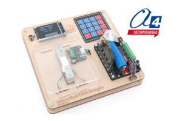

# a4-microsystem-weight



MakeCode extension for the **A4 Technologie microSySTEM-Weight** educational electronic scale for **BBC micro:bit**.

The microSySTEM-Weight introduces mass measurement through a concrete commercial or industrial weighing application. It combines a strain-gauge weighing system, a programmable color LCD and a 4 × 4 keypad. Students can measure, value or count articles and build their own automated scale programs.

## Product and educational use

The model is designed for technology, computer science and STEM education. It can be used to study:

- acquisition of a physical quantity with a strain gauge;
- mass measurement, tare and calibration;
- measurement stability, accuracy and data filtering;
- unit conversion and price-per-kilogram calculations;
- identification and valuation of articles with a keypad;
- counting identical objects from their mass;
- information processing and human-machine interfaces;
- commercial and industrial weighing applications.

**Product:** microSySTEM-Weight  
**Reference:** `MIS-WEI-K01`  
**Dimensions:** 200 × 200 × 90 mm  
**Delivery:** kit, approximately 20 minutes assembly time

Product page:  
https://www.a4.fr/weight-maquette-programmable-microsystem-pour-micro-bit.html

Manufacturer:  
https://www.a4.fr

The model includes an integrated lithium-battery holder and charging system for autonomous operation. The BBC micro:bit, 18650 battery, programming cable and USB-C charging cable are ordered separately with the `MIS-WEI-K01` version.

## Hardware

The microSySTEM-Weight model uses:

- BBC micro:bit - program execution and user interface;
- DFR1216 expansion board - connection and power interface;
- DFRobot Gravity I2C Weight Sensor Kit KIT0176 - acquisition of the strain-gauge signal;
- programmable color LCD - display of measurements and instructions;
- 4 × 4 matrix keypad - article selection and data entry.

### Connections used by the extension

| Component | Connection |
|---|---|
| KIT0176 weighing module | 3.3 V I2C port - address `0x64` |
| DFRobot color LCD | 3.3 V I2C port |
| Keypad rows | P15, P14, P13, P8 |
| Keypad columns | P3, P2, P1, P0 |

> The 8-pin keypad connector is intentionally used in the reversed orientation shown above. Initializing the keypad disables the micro:bit LED matrix because pin P3 is required by the keypad.

## Add the extension in MakeCode

1. Open [MakeCode for micro:bit](https://makecode.microbit.org/).
2. Create or open a project.
3. Select **Extensions**.
4. Paste the repository URL into the search field:

```text
https://github.com/A4-TECHNOLOGIE/a4-microSySTEM-Weight
```

5. Select **a4 microSySTEM Weight**.

The official DFRobot `lcdDisplay` dependency is added automatically and its blocks can be used alongside the A4 scale and keypad blocks.

## First use

Keep the weighing tray empty and stable when initializing the scale. Initialize the keypad only when it is required:

```typescript
a4MicroSystemWeight.initializeScale()
a4MicroSystemWeight.initializeKeypad()
```

The scale and keypad functions also initialize their hardware automatically when required, but explicit initialization makes the program sequence easier to understand.

## Calibration with a 100 g reference mass

The A4 teaching activities use a **100 g reference mass**.

1. Place the model on a stable, level surface.
2. Remove every object from the weighing tray.
3. Run **start scale calibration**.
4. Place the 100 g reference mass in the center of the tray.
5. Wait until the mechanical assembly is stable.
6. Run **calibrate scale with a reference mass of 100 g**.

```typescript
a4MicroSystemWeight.startCalibration()

// Place the 100 g reference mass on the tray before this call.
let calibrationOk = a4MicroSystemWeight.finishCalibration(100)
```

The second function returns `true` when a valid calibration factor has been calculated. The factor remains active until the program restarts. A previously determined factor can be restored at startup with `setCalibrationFactor(...)`.

## Blocks / API

### Initialize the scale

```typescript
a4MicroSystemWeight.initializeScale()
```

Initializes the I2C weighing module, discards the first readings and records the current empty-scale value. [Detailed help](docs/initialize-scale.md)

### Tare the scale

```typescript
a4MicroSystemWeight.tareScale()
```

Sets the current load to zero. Keep the tray mechanically stable while the tare is being performed. [Detailed help](docs/tare-scale.md)

### Read the mass in grams

```typescript
let mass = a4MicroSystemWeight.massGrams()
```

Returns the measured mass in grams using averaged samples and the current calibration factor. [Detailed help](docs/mass-grams.md)

### Check the weighing module

```typescript
let connected = a4MicroSystemWeight.scaleConnected()
```

Returns `true` when a valid data frame can be read from the KIT0176 weighing module. [Detailed help](docs/scale-connected.md)

### Start and complete a two-step calibration

```typescript
a4MicroSystemWeight.startCalibration()
let calibrationOk = a4MicroSystemWeight.finishCalibration(100)
```

The first function records the unloaded value. The second calculates the calibration factor from the known reference mass. [Start help](docs/start-calibration.md) - [Finish help](docs/finish-calibration.md)

### Initialize the 4 × 4 keypad

```typescript
a4MicroSystemWeight.initializeKeypad()
```

Configures the keypad pins and disables the micro:bit LED matrix because P3 is used as a keypad column. [Detailed help](docs/initialize-keypad.md)

### Read the key currently pressed

```typescript
let key = a4MicroSystemWeight.pressedKey()
```

Returns `"1"` to `"9"`, `"0"`, `"A"` to `"D"`, `"*"` or `"#"`. It returns an empty string when no stable key press is detected. [Detailed help](docs/pressed-key.md)

### Wait for one complete key press

```typescript
let key = a4MicroSystemWeight.waitForKey()
```

Waits for a key press and release, then returns the key as text. [Detailed help](docs/wait-for-key.md)

### Test a selected key

```typescript
let pressed = a4MicroSystemWeight.keyIsPressed(
    a4MicroSystemWeight.WeightKey.A
)
```

Returns `true` while the selected keypad key is pressed. [Detailed help](docs/key-is-pressed.md)

### Advanced calibration and diagnostics

```typescript
a4MicroSystemWeight.setCalibrationFactor(2236)
let factor = a4MicroSystemWeight.getCalibrationFactor()
let rawValue = a4MicroSystemWeight.rawAverage(10)
```

These advanced blocks apply a known calibration factor, return the current factor or expose averaged raw sensor data for diagnostics.

- [Set calibration factor help](docs/set-calibration-factor.md)
- [Get calibration factor help](docs/get-calibration-factor.md)
- [Raw average help](docs/raw-average.md)

## Example: simple mass measurement

The following example initializes the scale with an empty tray, continuously sends the rounded mass to the serial console and uses button A to perform a new tare.

```typescript
// Button A sets the current load as the new zero value.
input.onButtonPressed(Button.A, function () {
    a4MicroSystemWeight.tareScale()
})

// The tray must be empty and stable during initialization.
a4MicroSystemWeight.initializeScale()

basic.forever(function () {
    serial.writeValue(
        "mass_g",
        Math.round(a4MicroSystemWeight.massGrams())
    )
    basic.pause(250)
})
```

Additional ready-to-use programs are available in the [`examples`](examples) folder for mass and tare, 100 g calibration and keypad testing.

## Testing and validation

The root [`test.ts`](test.ts) file provides compilation coverage for every public API without attempting to access physical I2C hardware in the simulator.

The complete hardware procedure, expected results and pass/fail criteria are documented in [`TESTING.md`](TESTING.md).

## Artificial intelligence extension

The microSySTEM-Weight can also be associated with the **microSySTEM-AI Vision** model. Visual recognition can be used for advanced scenarios such as automatic article identification, price checking or comparison between the recognized item and the value selected on the keypad.

More information and programming examples are available in the technical and educational documentation for the microSySTEM-AI Vision model.

## Français

Cette extension MakeCode permet de programmer la balance pédagogique **microSySTEM-Weight** d'A4 Technologie.

La maquette `MIS-WEI-K01` permet d'étudier la mesure de masse et de développer une balance de type commercial ou industriel. Elle associe une jauge de contrainte, un clavier souple 4 × 4 et un écran LCD couleur programmable. Les blocs prennent en charge l'initialisation du capteur, la tare, l'étalonnage avec une masse connue, la lecture de la masse en grammes et le clavier inversé de la maquette.

Les activités A4 utilisent une masse étalon de **100 g**.

- [Page produit microSySTEM-Weight](https://www.a4.fr/weight-maquette-programmable-microsystem-pour-micro-bit.html)
- [Site A4 Technologie](https://www.a4.fr)

## License

This extension is released under the **MIT License**. See [LICENSE.txt](LICENSE.txt).

## A4 Technologie

Designed for educational use by A4 Technologie.

https://www.a4.fr

---

for PXT/microbit
